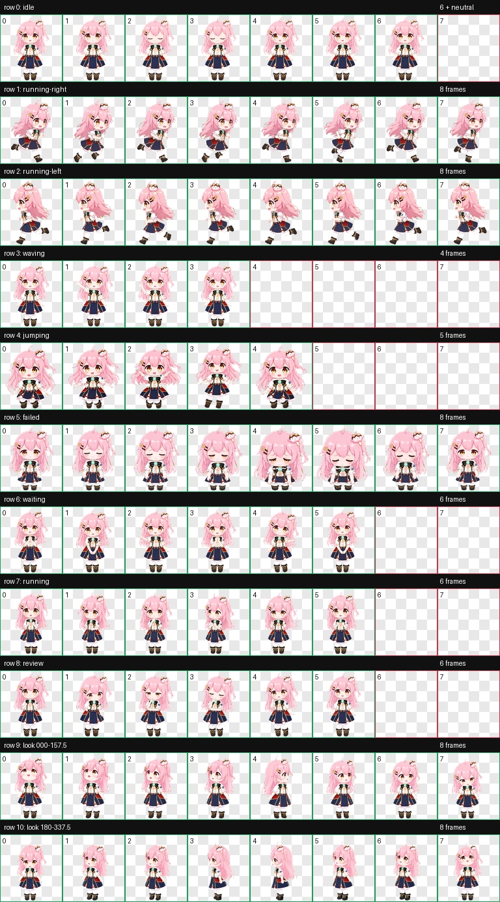

# 永雏小菲 Codex 任务宠物

一个供 Codex Desktop 使用的非官方同人任务宠物，包含待机、移动、挥手、跳跃、任务状态以及 16 方向鼠标观察动画。

## 安装

将 `pet/ace-taffy-xiaofei` 复制到 `%USERPROFILE%/.codex/pets/`，完全重启 Codex，然后在设置中的外观或头像选项选择“永雏小菲”。

## 内容

- `pet/ace-taffy-xiaofei/`：可安装宠物包
- `skills/build-codex-task-pet/`：从角色参考图制作 Codex 任务宠物的复用 skill
- `docs/`：预览与验证结果

## 权利说明

这是非官方、非商业的同人项目，与角色权利方或平台没有隶属或背书关系。代码使用 MIT License；角色名称、角色设定和图像素材不随代码许可证授权。若权利方认为内容不适合公开，请通过 GitHub Issue 联系移除。

公开使用或再分发前，请自行核对角色方最新的二创与素材使用规则。

## 后续优化路线

- 使用 2×或 4×母版生成，再缩小到每格 192×208，提升线条、眼睛和发饰稳定性。
- 重绘 135°、157.5°、202.5°、225°、315°、337.5°等表现较弱的斜向视线。
- 统一各动画行的脸型、发色、蝴蝶结、服装纹样和身体比例。
- 调整移动与跳跃帧的脚底接触点、重心轨迹和循环首尾衔接。
- 在浅色、深色和高饱和桌面背景上检查透明边缘与缩放锐度。
- 保留无损 PNG 母版，仅将最终运行图集导出为 RGBA WebP。
